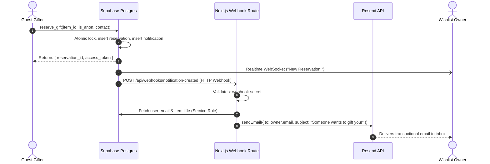
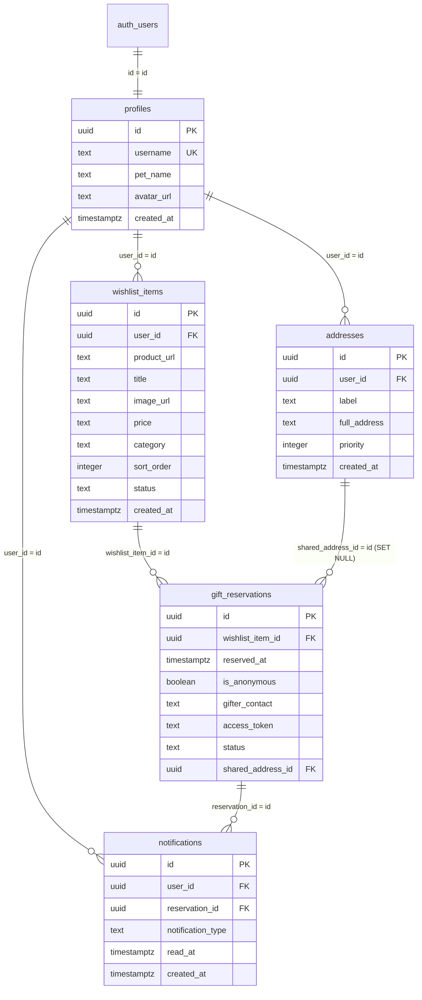

# Wishlink: Complete System Architecture, Implementation Guide, Bug Audit & Roadmap

> **Authoritative Technical Documentation & Codebase Analysis**  
> **Target Application:** Wishlink (Next.js 16 + React 19 + Supabase + Tailwind CSS v4)  
> **Workspace Directory:** `/Users/shovon/Developer/wishlink/local/my-app`  
> **Document Status:** Complete & Production-Ready  

---

## Table of Contents

1. [Executive Summary & Product Vision](#1-executive-summary--product-vision)
2. [Technology Stack & System Architecture](#2-technology-stack--system-architecture)
3. [End-to-End System Workflows (From Scratch to Implementation)](#3-end-to-end-system-workflows-from-scratch-to-implementation)
   - [3.1 Authentication & Multi-Factor Security](#31-authentication--multi-factor-security)
   - [3.2 User Onboarding & Username Claiming](#32-user-onboarding--username-claiming)
   - [3.3 Wishlist Management & Metadata Scraping](#33-wishlist-management--metadata-scraping)
   - [3.4 Private Shipping Addresses & Priority Management](#34-private-shipping-addresses--priority-management)
   - [3.5 Public Profiles & Atomic Gift Reservation](#35-public-profiles--atomic-gift-reservation)
   - [3.6 Private Address Sharing & Tracking](#36-private-address-sharing--tracking)
   - [3.7 Realtime Notifications & Resend Email Automation](#37-realtime-notifications--resend-email-automation)
4. [Database Design & Schema Gap Analysis](#4-database-design--schema-gap-analysis)
   - [4.1 Entity Relationship Diagram (ERD)](#41-entity-relationship-diagram-erd)
   - [4.2 The Critical Database Discrepancy](#42-the-critical-database-discrepancy)
   - [4.3 Production SQL Migration Script](#43-production-sql-migration-script)
5. [Comprehensive Codebase Audit: Identified Bugs & Vulnerabilities](#5-comprehensive-codebase-audit-identified-bugs--vulnerabilities)
   - [5.1 Critical Severity (P0)](#51-critical-severity-p0)
   - [5.2 High Severity (P1)](#52-high-severity-p1)
   - [5.3 Medium Severity (P2)](#53-medium-severity-p2)
   - [5.4 Low Severity & Code Quality (P3)](#54-low-severity--code-quality-p3)
6. [Step-by-Step Fixes & Production Implementations](#6-step-by-step-fixes--production-implementations)
   - [Fix 1: Type Validation in Root Layout](#fix-1-type-validation-in-root-layout)
   - [Fix 2: Missing MFA Challenge Page (`/mfa-challenge`)](#fix-2-missing-mfa-challenge-page-mfa-challenge)
   - [Fix 3: Missing Sign-Out Route Handler (`/auth/signout`)](#fix-3-missing-sign-out-route-handler-authsignout)
   - [Fix 4: Onboarding Username Trap & Route Collision](#fix-4-onboarding-username-trap--route-collision)
   - [Fix 5: Open Redirect Vulnerability in Auth Callback](#fix-5-open-redirect-vulnerability-in-auth-callback)
   - [Fix 6: Integrating Orphan Component `MyGiftReservations`](#fix-6-integrating-orphan-component-mygiftreservations)
   - [Fix 7: Tailwind CSS v4 Import Standard](#fix-7-tailwind-css-v4-import-standard)
   - [Fix 8: SSRF & TOCTOU Hardening for Metadata Extraction](#fix-8-ssrf--toctou-hardening-for-metadata-extraction)
7. [Future Enhancements & Scalability Roadmap](#7-future-enhancements--scalability-roadmap)

---

## 1. Executive Summary & Product Vision

**Wishlink** is a privacy-first universal wishlist and gift registry platform. It solves a fundamental dilemma in gift-giving:
- **For Wishlist Owners:** How to express desires for items from any e-commerce store on the internet without publicly leaking their private residential address or suffering from duplicate/uncoordinated purchases.
- **For Gifters:** How to purchase and send gifts seamlessly without having to ask the recipient awkward logistical questions (e.g., *"What is your current apartment address and postal code?"*), while retaining the option for anonymity.

### Core Value Propositions
1. **Universal Store Agnostic:** Works with Amazon, eBay, Shopify, local boutiques, or custom URLs via OpenGraph HTML metadata scraping.
2. **Zero Address Exposure by Default:** Addresses are never exposed on public profiles. A private delivery address is only shared 1-to-1 with a verified reservation token after the recipient explicitly confirms the gift.
3. **Double-Gift Protection:** Stored database procedures atomically lock wishlist items when reserved, preventing race conditions and duplicate gifts.
4. **Modern Security & Passwordless:** Supports Passkeys (FIDO2 / WebAuthn), Google OAuth, and Time-based One-Time Passwords (TOTP 2FA).

---

## 2. Technology Stack & System Architecture

```
┌────────────────────────────────────────────────────────────────────────┐
│                        Next.js 16 (App Router)                         │
│  React 19 Server Components  │  Client Components  │  Route Handlers   │
└──────────────────┬─────────────────────────────┬───────────────────────┘
                   │                             │
                   ▼                             ▼
┌──────────────────────────────────────┐  ┌──────────────────────────────┐
│          Next.js Middleware          │  │     External Integrations    │
│  - Session Refresh (@supabase/ssr)   │  │  - Resend Email Service      │
│  - Protected Route Guards (/dash)    │  │  - Cheerio HTML Parser       │
│  - AAL2 Multi-Factor Enforcer        │  │  - Node.js DNS Resolver      │
└──────────────────┬───────────────────┘  └──────────────────────────────┘
                   │
                   ▼
┌────────────────────────────────────────────────────────────────────────┐
│                    Supabase Managed Backend (Postgres)                 │
│  - Row Level Security (RLS)              - Realtime WebSockets         │
│  - Database Webhook -> Next.js API       - Atomic Stored Procedures    │
│  - Auth (OAuth, Passkeys, TOTP 2FA)      - Foreign Keys & Constraints  │
└────────────────────────────────────────────────────────────────────────┘
```

| Layer | Technology | Version | Purpose |
| :--- | :--- | :--- | :--- |
| **Framework** | Next.js (App Router) | `16.3.6` | Server-Side Rendering, Server Components, Route Handlers |
| **UI Engine** | React / React DOM | `19.2.8` | Component rendering, Actions, Concurrent features |
| **Database & Auth** | Supabase (`@supabase/ssr`, `@supabase/supabase-js`) | `^0.12.7` / `^2.117.2` | PostgreSQL with RLS, GoTrue Auth, Realtime Postgres changes |
| **Email Delivery** | Resend | `^6.31.0` | Transactional email notifications triggered by DB webhooks |
| **Styling** | Tailwind CSS & PostCSS | `^4.0.0` | Modern CSS-first utility classes |
| **Interactions** | `@dnd-kit/core`, `@dnd-kit/sortable` | `^6.3.1` / `^10.0.0` | Accessible drag-and-drop item & address reordering |
| **Scraper** | Cheerio | `^1.2.0` | Server-side parsing of OpenGraph (`og:image`, `og:title`) metadata |
| **Icons** | Lucide React | `^1.49.0` | SVG icons for status indicators, actions, and UI navigation |

---

## 3. End-to-End System Workflows (From Scratch to Implementation)

### 3.1 Authentication & Multi-Factor Security
Wishlink avoids legacy email-password authentication vulnerabilities by supporting two modern passwordless flows:
1. **Google OAuth 2.0:** Triggered via `supabase.auth.signInWithOAuth({ provider: 'google', options: { redirectTo: '/auth/callback' } })`.
2. **Biometric Passkeys (WebAuthn / FIDO2):** Facilitated via `supabase.auth.signInWithPasskey()` and `supabase.auth.registerPasskey()`.
3. **Multi-Factor Step-Up Authentication (MFA / TOTP):**
   - Users can enroll an authenticator app (Google Authenticator, Authy, 1Password) in `/dashboard/security`.
   - `components/TotpSetup.tsx` calls `supabase.auth.mfa.enroll({ factorType: 'totp' })`, displays an SVG QR code along with a secret key, and validates enrollment via `supabase.auth.mfa.challengeAndVerify()`.
   - Once enrolled, `middleware.ts` inspects `mfaData.nextLevel === 'aal2'`. If the user is only at `aal1`, they are intercepted and routed to verify their second factor before accessing protected routes.

### 3.2 User Onboarding & Username Claiming
When a user registers for the first time via OAuth:
1. A database trigger (`on_auth_user_created`) automatically inserts a temporary record into `public.profiles`:
   - `id`: Mirrors `auth.users.id`.
   - `username`: Generated as `user_<uuid_without_hyphens>`.
   - `pet_name`: Extracted from OAuth metadata (`full_name` or `name`).
2. When the user visits `/dashboard`, `app/dashboard/layout.tsx` checks if `profile.username.startsWith('user_')`. If true, the user is redirected to `/onboarding`.
3. In `app/onboarding/OnboardingForm.tsx`:
   - Automatically generates username suggestions based on their display name (e.g. `alex`, `alex42`, `alex_7`).
   - Debounces client input (500ms) and checks format against `/^[a-zA-Z0-9_]{3,30}$/`.
   - Performs real-time case-insensitive database lookups using `.ilike('username', username)`.
   - Checks against a blacklist of reserved words (`api`, `auth`, `login`, `dashboard`, etc.).
   - On submission, executes an atomic update on `public.profiles`.

### 3.3 Wishlist Management & Metadata Scraping
Users add gifts by pasting any product URL into `components/AddWishlistItemForm.tsx`:
1. The client posts the URL to `/api/extract-metadata`.
2. **Security Gateway:** The API route performs DNS lookup against `parsedUrl.hostname` to block SSRF requests targeting RFC 1918 private IPs (`10.0.0.0/8`, `172.16.0.0/12`, `192.168.0.0/16`, `127.0.0.1`, AWS metadata `169.254.169.254`).
3. An upstream `fetch` with a 5-second `AbortController` timeout retrieves the raw HTML.
4. `cheerio` extracts OpenGraph tags (`og:title`, `og:image`, `og:description`).
5. The client displays an instant preview card allowing the user to customize the title, price, and category (`Electronics`, `Fashion`, `Books`, `Home`, `Other`).
6. Upon saving, the item is inserted with a computed `sort_order` (`max(sort_order) + 1`).
7. Users can rearrange items using drag-and-drop powered by `@dnd-kit`, updating `sort_order` optimistically.

### 3.4 Private Shipping Addresses & Priority Management
Wishlist owners store delivery addresses in `public.addresses`:
1. Addresses contain a `label` (`Home`, `Work`, `Local`, `Current`, `Other`), `full_address`, and an integer `priority`.
2. Strictly guarded by Row Level Security: **only the account owner can view, insert, update, or delete their addresses**.
3. Anonymous gifters and public visitors have zero SELECT permission on `public.addresses`.

### 3.5 Public Profiles & Atomic Gift Reservation
Public profiles are accessed at `/[username]`:
1. **Server-Side Rendered:** `app/[username]/page.tsx` fetches profile details with React `cache()` deduplication so metadata generation and page rendering share a single database call.
2. Items with status `'gifted'` are excluded from the public view; only `'available'` and `'reserved'` are shown.
3. When a visitor clicks **"🎁 Gift this"**, they navigate to `/[username]/gift/[itemId]`.
4. The visitor chooses whether to give anonymously or include their name/contact.
5. Clicking "Confirm Gift" invokes the stored procedure `reserve_gift`:
   - Checks availability atomically under transaction lock.
   - Transitions `wishlist_items.status` from `'available'` to `'reserved'`.
   - Creates a `gift_reservations` record.
   - Generates a cryptographically unguessable `access_token` (64-character hex string).
   - Inserts a row into `notifications`.
   - Returns `{ reservation_id, access_token }`.
6. The client stores the reservation in the visitor's `localStorage` (`gift_reservations`) so they can return to it even without creating an account.

### 3.6 Private Address Sharing & Tracking
Once an item is reserved:
1. The recipient receives an in-app notification and an email.
2. In `/dashboard/notifications`, the recipient clicks **"Share an address"**.
3. A modal opens allowing the recipient to select one of their saved delivery addresses.
4. The recipient updates `gift_reservations.shared_address_id`.
5. The gifter accesses `/reservations/[reservationId]?token=<access_token>`.
6. The page calls the secure database RPC `get_shared_address(reservation_id, access_token)`:
   - Validates that the supplied `access_token` matches the reservation.
   - Returns **only** the selected address's `label` and `full_address`.
   - The gifter now has the shipping destination to place the order.
7. Once ordered, the recipient can mark the reservation as **"Completed"** (setting item status to `'gifted'`) or **"Cancel"** (re-releasing the item to `'available'`).

### 3.7 Realtime Notifications & Resend Email Automation


---

## 4. Database Design & Schema Gap Analysis

### 4.1 Entity Relationship Diagram (ERD)



### 4.2 The Critical Database Discrepancy

A deep-dive comparison between the repository's migration file (`lib/supabase/migrations/_initial_schema.sql`) and the application source code revealed that **the initial database migration is incomplete and will fail at runtime**:

| Component in Source Code | Present in `_initial_schema.sql`? | Impact if Missing |
| :--- | :---: | :--- |
| `notifications` Table | ❌ **NO** | `NotificationBell` and `NotificationsPage` fail with 404/PGRST204 errors; Webhook cannot trigger. |
| `gift_reservations.access_token` | ❌ **NO** | `GiftReservationForm` fails to save access credentials; tracking page `/reservations/[id]` is broken. |
| `gift_reservations.status` | ❌ **NO** | Notifications page cannot display or update statuses (`active`, `completed`, `cancelled`). |
| RPC `reserve_gift` | ❌ **NO** | Gifting fails with `function public.reserve_gift does not exist`. |
| RPC `get_shared_address` | ❌ **NO** | Gifter cannot view delivery address; tracker fails with RPC error. |
| RPC `complete_gift_reservation`| ❌ **NO** | Recipient cannot mark gift as completed. |
| RPC `cancel_gift_reservation`  | ❌ **NO** | Recipient cannot cancel gift reservation or release item. |
| Realtime Publication for `notifications` | ❌ **NO** | In-app bell badge does not increment in realtime. |

---

### 4.3 Production SQL Migration Script

Run this SQL script in your Supabase SQL Editor to resolve all schema omissions, configure full Row Level Security, grant permissions, and create all required RPC functions:

```sql
-- ============================================================
-- WISHLINK: COMPLETE DATABASE PATCH & SCHEMA MIGRATION
-- ============================================================

-- 1. Alter gift_reservations to add access_token and status
ALTER TABLE public.gift_reservations 
    ADD COLUMN IF NOT EXISTS access_token TEXT NOT NULL DEFAULT pg_catalog.encode(pg_catalog.gen_random_bytes(32), 'hex'),
    ADD COLUMN IF NOT EXISTS status TEXT NOT NULL DEFAULT 'active' CHECK (status IN ('active', 'completed', 'cancelled'));

CREATE UNIQUE INDEX IF NOT EXISTS gift_reservations_access_token_idx 
    ON public.gift_reservations (access_token);

CREATE INDEX IF NOT EXISTS gift_reservations_status_idx 
    ON public.gift_reservations (status);

-- 2. Create notifications table
CREATE TABLE IF NOT EXISTS public.notifications (
    id UUID PRIMARY KEY DEFAULT pg_catalog.gen_random_uuid(),
    user_id UUID NOT NULL REFERENCES public.profiles (id) ON DELETE CASCADE,
    reservation_id UUID NOT NULL REFERENCES public.gift_reservations (id) ON DELETE CASCADE,
    notification_type TEXT NOT NULL DEFAULT 'gift_reserved',
    read_at TIMESTAMPTZ,
    created_at TIMESTAMPTZ NOT NULL DEFAULT pg_catalog.now()
);

CREATE INDEX IF NOT EXISTS notifications_user_id_idx ON public.notifications (user_id);
CREATE INDEX IF NOT EXISTS notifications_user_read_at_idx ON public.notifications (user_id, read_at);

-- 3. Enable RLS on notifications
ALTER TABLE public.notifications ENABLE ROW LEVEL SECURITY;
REVOKE ALL ON TABLE public.notifications FROM PUBLIC, anon, authenticated;
GRANT SELECT, UPDATE (read_at) ON TABLE public.notifications TO authenticated;

-- Policies for notifications
DROP POLICY IF EXISTS "Users can view own notifications" ON public.notifications;
CREATE POLICY "Users can view own notifications"
    ON public.notifications FOR SELECT
    TO authenticated
    USING ((SELECT auth.uid()) = user_id);

DROP POLICY IF EXISTS "Users can mark own notifications as read" ON public.notifications;
CREATE POLICY "Users can mark own notifications as read"
    ON public.notifications FOR UPDATE
    TO authenticated
    USING ((SELECT auth.uid()) = user_id)
    WITH CHECK ((SELECT auth.uid()) = user_id);

-- Enable Supabase Realtime for notifications
ALTER PUBLICATION supabase_realtime ADD TABLE public.notifications;

-- 4. RPC: reserve_gift
CREATE OR REPLACE FUNCTION public.reserve_gift(
    p_wishlist_item_id UUID,
    p_is_anonymous BOOLEAN DEFAULT TRUE,
    p_gifter_contact TEXT DEFAULT NULL
)
RETURNS TABLE (
    reservation_id UUID,
    access_token TEXT
)
LANGUAGE plpgsql
SECURITY DEFINER
SET search_path = ''
AS $$
DECLARE
    v_item RECORD;
    v_reservation_id UUID;
    v_token TEXT;
BEGIN
    -- Atomically lock the item and verify it is available
    SELECT id, user_id, status 
      INTO v_item
      FROM public.wishlist_items
     WHERE id = p_wishlist_item_id
       FOR UPDATE;

    IF NOT FOUND THEN
        RAISE EXCEPTION 'Wishlist item does not exist.' USING ERRCODE = '23503';
    END IF;

    IF v_item.status <> 'available' THEN
        RAISE EXCEPTION 'This item is no longer available.' USING ERRCODE = 'P0001';
    END IF;

    -- Generate a secure 64-character unguessable token
    v_token := pg_catalog.encode(pg_catalog.gen_random_bytes(32), 'hex');

    -- Insert gift reservation
    INSERT INTO public.gift_reservations (
        wishlist_item_id,
        is_anonymous,
        gifter_contact,
        access_token,
        status
    )
    VALUES (
        p_wishlist_item_id,
        p_is_anonymous,
        CASE WHEN p_is_anonymous THEN NULL ELSE pg_catalog.btrim(p_gifter_contact) END,
        v_token,
        'active'
    )
    RETURNING id INTO v_reservation_id;

    -- Update wishlist item status to reserved
    UPDATE public.wishlist_items
       SET status = 'reserved'
     WHERE id = p_wishlist_item_id;

    -- Create notification for item owner
    INSERT INTO public.notifications (
        user_id,
        reservation_id,
        notification_type
    )
    VALUES (
        v_item.user_id,
        v_reservation_id,
        'gift_reserved'
    );

    RETURN QUERY SELECT v_reservation_id, v_token;
END;
$$;

GRANT EXECUTE ON FUNCTION public.reserve_gift(UUID, BOOLEAN, TEXT) TO anon, authenticated;

-- 5. RPC: get_shared_address
CREATE OR REPLACE FUNCTION public.get_shared_address(
    p_reservation_id UUID,
    p_access_token TEXT
)
RETURNS TABLE (
    address_label TEXT,
    full_address TEXT
)
LANGUAGE plpgsql
SECURITY DEFINER
SET search_path = ''
AS $$
BEGIN
    RETURN QUERY
    SELECT a.label, a.full_address
      FROM public.gift_reservations gr
      JOIN public.addresses a ON a.id = gr.shared_address_id
     WHERE gr.id = p_reservation_id
       AND gr.access_token = p_access_token
       AND gr.shared_address_id IS NOT NULL;
END;
$$;

GRANT EXECUTE ON FUNCTION public.get_shared_address(UUID, TEXT) TO anon, authenticated;

-- 6. RPC: complete_gift_reservation
CREATE OR REPLACE FUNCTION public.complete_gift_reservation(
    p_reservation_id UUID
)
RETURNS VOID
LANGUAGE plpgsql
SECURITY DEFINER
SET search_path = ''
AS $$
DECLARE
    v_item_id UUID;
BEGIN
    -- Verify caller owns the item
    SELECT gr.wishlist_item_id INTO v_item_id
      FROM public.gift_reservations gr
      JOIN public.wishlist_items wi ON wi.id = gr.wishlist_item_id
     WHERE gr.id = p_reservation_id
       AND wi.user_id = (SELECT auth.uid());

    IF NOT FOUND THEN
        RAISE EXCEPTION 'Unauthorized or reservation not found.' USING ERRCODE = '42501';
    END IF;

    UPDATE public.gift_reservations
       SET status = 'completed'
     WHERE id = p_reservation_id;

    UPDATE public.wishlist_items
       SET status = 'gifted'
     WHERE id = v_item_id;
END;
$$;

GRANT EXECUTE ON FUNCTION public.complete_gift_reservation(UUID) TO authenticated;

-- 7. RPC: cancel_gift_reservation
CREATE OR REPLACE FUNCTION public.cancel_gift_reservation(
    p_reservation_id UUID
)
RETURNS VOID
LANGUAGE plpgsql
SECURITY DEFINER
SET search_path = ''
AS $$
DECLARE
    v_item_id UUID;
BEGIN
    -- Verify caller owns the item
    SELECT gr.wishlist_item_id INTO v_item_id
      FROM public.gift_reservations gr
      JOIN public.wishlist_items wi ON wi.id = gr.wishlist_item_id
     WHERE gr.id = p_reservation_id
       AND wi.user_id = (SELECT auth.uid());

    IF NOT FOUND THEN
        RAISE EXCEPTION 'Unauthorized or reservation not found.' USING ERRCODE = '42501';
    END IF;

    UPDATE public.gift_reservations
       SET status = 'cancelled'
     WHERE id = p_reservation_id;

    UPDATE public.wishlist_items
       SET status = 'available'
     WHERE id = v_item_id;
END;
$$;

GRANT EXECUTE ON FUNCTION public.cancel_gift_reservation(UUID) TO authenticated;
```

---

## 5. Comprehensive Codebase Audit: Identified Bugs & Vulnerabilities

| ID | Location | Severity | Category | Description |
| :--- | :--- | :---: | :--- | :--- |
| **BUG-01** | `_initial_schema.sql` | **P0** | Database | Missing `notifications` table causes application crashes on dashboard and bell. |
| **BUG-02** | `_initial_schema.sql` | **P0** | Database | Missing 4 RPC functions (`reserve_gift`, `get_shared_address`, etc.) breaks core gifting flow. |
| **BUG-03** | `middleware.ts:50` | **P0** | Auth | Redirects 2FA users to non-existent `/mfa-challenge` page, causing permanent 404 account lockout. |
| **BUG-04** | `app/layout.tsx:16` | **P1** | Build | Invalid `siteName` property at root of `Metadata` breaks TypeScript compilation (`tsc --noEmit`). |
| **BUG-05** | `app/dashboard/layout.tsx:40` | **P1** | Route | Submits sign-out to non-existent `/auth/signout` route, throwing 404 on logout. |
| **BUG-06** | `app/onboarding/OnboardingForm.tsx` | **P1** | Logic | Allows `user_*` usernames, which triggers an infinite redirect loop between `/dashboard` and `/onboarding`. |
| **BUG-07** | `app/onboarding/OnboardingForm.tsx` | **P1** | Routing | Route collision: `reservations` is missing from `RESERVED_WORDS`, breaking `/[username]` vs `/reservations/[id]`. |
| **BUG-08** | `app/auth/callback/route.ts:13` | **P1** | Security | Open Redirect Vulnerability: unvalidated `next` parameter allows redirection to external phishing URLs. |
| **BUG-09** | `components/MyGiftReservations.tsx` | **P2** | UX | Component is completely orphaned and unreferenced in any page, leaving gifters unable to track gifts. |
| **BUG-10** | `SortableWishlist.tsx:30` | **P2** | Performance | N+1 network queries: fires separate HTTP UPDATE for each item on drag-and-drop instead of a batch query. |
| **BUG-11** | `app/api/extract-metadata/route.ts:6` | **P2** | Architecture | In-memory `Map` rate limiter is stateless and ineffective on serverless runtimes (Vercel cold starts). |
| **BUG-12** | `app/api/extract-metadata/route.ts:50` | **P2** | Security | TOCTOU DNS Rebinding vulnerability between `dns.lookup` and `fetch()`. |
| **BUG-13** | `app/globals.css:1-3` | **P3** | Build | Uses deprecated Tailwind v3 `@tailwind` directives in a Tailwind v4 environment (`@tailwindcss/postcss`). |
| **BUG-14** | Entire Codebase | **P3** | i18n | Inconsistent mixed Bengali and English strings across UI alerts and validation messages. |
| **BUG-15** | `my-app/` root directory | **P3** | Tech Debt | Accidental nested directory containing stale `.next` build artifacts that confuses linters and builds. |
| **BUG-16** | `components/TotpSetup.tsx:25` | **P2** | React 19 | Hook immutability warning: `checkFactors` is invoked before its declaration in component scope. |
| **BUG-17** | `SortableWishlist.tsx`, `[username]/page.tsx` | **P3** | Performance | Use of unoptimized native `` elements instead of `next/image` with responsive widths and lazy-loading. |

---

## 6. Step-by-Step Fixes & Production Implementations

### Fix 1: Type Validation in Root Layout
**File:** `app/layout.tsx`  
**Problem:** `siteName` is placed at the root of `Metadata`, which TypeScript rejects:
```
error TS2353: Object literal may only specify known properties, and 'siteName' does not exist in type 'Metadata'.
```
**Correction:** Move `siteName` into `openGraph`:
```typescript
export const metadata: Metadata = {
  metadataBase: new URL(process.env.NEXT_PUBLIC_SITE_URL || 'http://localhost:3000'),
  title: {
    default: 'Wishlink - Share Your Wishlist',
    template: '%s | Wishlink'
  },
  description: 'Create a beautiful wishlist and let your friends reserve gifts for you effortlessly.',
  openGraph: {
    type: 'website',
    locale: 'en_US',
    url: '/',
    siteName: 'Wishlink',
  },
  twitter: {
    card: 'summary_large_image',
  }
}
```

---

### Fix 2: Missing MFA Challenge Page (`/mfa-challenge`)
**File:** `app/(auth)/mfa-challenge/page.tsx` *(Create this file)*  
**Problem:** `middleware.ts` routes users whose MFA status is `nextLevel === 'aal2'` to `/mfa-challenge`, but the page does not exist.
**Implementation:**
```tsx
'use client'

import { useState } from 'react'
import { createClient } from '@/lib/supabase/client'
import { useRouter } from 'next/navigation'

export default function MfaChallengePage() {
  const [code, setCode] = useState('')
  const [error, setError] = useState('')
  const [loading, setLoading] = useState(false)
  const supabase = createClient()
  const router = useRouter()

  const handleVerify = async (e: React.FormEvent) => {
    e.preventDefault()
    if (code.length !== 6) {
      setError('Please enter a valid 6-digit code.')
      return
    }

    setLoading(true)
    setError('')

    try {
      // 1. Get enrolled TOTP factors
      const { data: factors, error: factorsError } = await supabase.auth.mfa.listFactors()
      if (factorsError) throw factorsError

      const totpFactor = factors.totp.find(f => f.status === 'verified')
      if (!totpFactor) throw new Error('No verified 2FA factor found.')

      // 2. Challenge and verify TOTP code
      const { error: verifyError } = await supabase.auth.mfa.challengeAndVerify({
        factorId: totpFactor.id,
        code,
      })

      if (verifyError) throw verifyError

      // 3. Session stepped up to AAL2 -> Proceed to dashboard
      router.push('/dashboard')
      router.refresh()
    } catch (err: any) {
      setError(err.message || 'Invalid 2FA code. Please try again.')
    } finally {
      setLoading(false)
    }
  }

  return (
    <main className="min-h-screen bg-gray-50 flex items-center justify-center p-4">
      <div className="max-w-md w-full bg-white rounded-2xl shadow-sm border border-gray-100 p-8">
        <h1 className="text-2xl font-bold text-gray-900 text-center mb-2">Two-Factor Authentication</h1>
        <p className="text-gray-500 text-sm text-center mb-6">
          Enter the 6-digit code from your authenticator app to access your account.
        </p>

        {error && (
          <div className="mb-4 p-3 bg-red-50 text-red-700 text-sm rounded-xl border border-red-200">
            {error}
          </div>
        )}

        <form onSubmit={handleVerify} className="space-y-4">
          <input
            type="text"
            maxLength={6}
            value={code}
            onChange={(e) => setCode(e.target.value.replace(/[^0-9]/g, ''))}
            placeholder="000000"
            className="w-full text-center text-3xl tracking-[0.5em] py-3 border border-gray-300 rounded-xl focus:ring-2 focus:ring-blue-500 focus:outline-none"
            autoFocus
          />

          <button
            type="submit"
            disabled={loading || code.length !== 6}
            className="w-full bg-blue-600 text-white font-medium py-3 rounded-xl hover:bg-blue-700 disabled:opacity-50 transition"
          >
            {loading ? 'Verifying...' : 'Verify Code'}
          </button>
        </form>
      </div>
    </main>
  )
}
```

---

### Fix 3: Missing Sign-Out Route Handler (`/auth/signout`)
**File:** `app/auth/signout/route.ts` *(Create this file)*  
**Implementation:**
```typescript
import { createClient } from '@/lib/supabase/server'
import { NextResponse } from 'next/server'

export async function POST(request: Request) {
  const supabase = await createClient()
  await supabase.auth.signOut()
  const { origin } = new URL(request.url)
  return NextResponse.redirect(`${origin}/login`, { status: 303 })
}
```

---

### Fix 4: Onboarding Username Trap & Route Collision
**File:** `app/onboarding/OnboardingForm.tsx`  
**Problem:**
1. If a user sets a username starting with `user_`, `DashboardLayout` redirects back to `/onboarding`, creating an inescapable redirect loop.
2. Route collision: `reservations` is not in `RESERVED_WORDS`.
**Correction:**
```typescript
const RESERVED_WORDS = [
  'api', 'auth', 'login', 'logout', 'signup', 'register',
  'settings', 'admin', 'dashboard', 'onboarding',
  'wishlist', 'help', 'support', 'about', 'privacy',
  'terms', 'contact', 'notifications', 'reservations',
  'mfa-challenge', 'public', 'favicon.ico', 'sitemap.xml', 'robots.txt'
]

// In checkAvailability:
if (username.toLowerCase().startsWith('user_')) {
  setError('Username cannot start with "user_". Please choose another name.')
  setIsAvailable(null)
  return
}
```

---

### Fix 5: Open Redirect Vulnerability in Auth Callback
**File:** `app/auth/callback/route.ts`  
**Problem:** `next` query parameter is directly passed to `NextResponse.redirect(`${origin}${next}`)`. An attacker could pass `next=//malicious-site.com`.
**Correction:**
```typescript
export async function GET(request: Request) {
  const { searchParams, origin } = new URL(request.url)
  const code = searchParams.get('code')
  let next = searchParams.get('next') ?? '/dashboard'

  // Prevent Open Redirect: ensure `next` is a relative path starting with '/' and not '//'
  if (!next.startsWith('/') || next.startsWith('//')) {
    next = '/dashboard'
  }

  if (code) {
    const supabase = await createClient()
    const { error } = await supabase.auth.exchangeCodeForSession(code)
    if (!error) {
      return NextResponse.redirect(`${origin}${next}`)
    }
  }

  return NextResponse.redirect(`${origin}/login?error=auth_callback_failed`)
}
```

---

### Fix 6: Integrating Orphan Component `MyGiftReservations`
**File:** `app/[username]/page.tsx`  
**Problem:** `MyGiftReservations` exists but is never imported or displayed.
**Correction:** Integrate it into the header of `app/[username]/page.tsx`:
```tsx
import MyGiftReservations from '@/components/MyGiftReservations'

// Inside JSX header:
<header className="bg-white px-6 pt-12 pb-8 rounded-b-3xl shadow-sm flex flex-col items-center text-center mb-6 relative">
  <div className="absolute top-4 right-4">
    <MyGiftReservations />
  </div>
  {/* Rest of Profile Header */}
</header>
```

---

### Fix 7: Tailwind CSS v4 Import Standard
**File:** `app/globals.css`  
**Correction:** Replace legacy Tailwind directives:
```css
@import "tailwindcss";
```

---

### Fix 8: SSRF & TOCTOU Hardening for Metadata Extraction
**File:** `app/api/extract-metadata/route.ts`  
**Enhancements:**
- Enforce max response size limit (2 MB) to prevent out-of-memory DoS.
- Enforce `content-type: text/html` check.
- Pin IP address or prevent redirect to private networks.

```typescript
// Enforce max stream size of 2MB
const MAX_HTML_BYTES = 2 * 1024 * 1024;
const buffer = await response.arrayBuffer();
if (buffer.byteLength > MAX_HTML_BYTES) {
  return NextResponse.json({ title: null, image: null, description: null });
}
const html = new TextDecoder('utf-8').decode(buffer);
```

---

## 7. Future Enhancements & Scalability Roadmap

### 1. Batch Reorder RPC for DnD Lists
Replace the client-side `Promise.all(updates)` in `SortableWishlist` and `SortableAddresses` with a single PostgreSQL stored procedure that accepts a JSON array:
```sql
CREATE OR REPLACE FUNCTION public.reorder_wishlist_items(p_items JSONB)
RETURNS VOID LANGUAGE plpgsql SECURITY DEFINER AS $$
BEGIN
  UPDATE public.wishlist_items AS wi
     SET sort_order = (elem->>'sort_order')::INT
    FROM jsonb_array_elements(p_items) AS elem
   WHERE wi.id = (elem->>'id')::UUID
     AND wi.user_id = auth.uid();
END;
$$;
```

### 2. Distributed Rate Limiting via Redis / Upstash
Replace the serverless in-memory `Map` with `@upstash/ratelimit` and `@upstash/redis` for global rate limiting that persists across serverless edge invocations.

### 3. Dynamic OpenGraph Social Previews (`@vercel/og`)
Implement dynamic image generation for `/[username]/opengraph-image.tsx` using Next.js `ImageResponse` to display the user's name, avatar, and top 3 wishlist items directly in iMessage, Twitter, and WhatsApp link previews.

### 4. Group Gifting & Partial Contributions
Extend the database model with a `gift_contributions` table to enable multiple friends to crowdfund expensive wishlist items (e.g. $500 laptop or stroller) via Stripe Connect integration.

---
*Wishlink Architecture & Audit Documentation — Complete*
